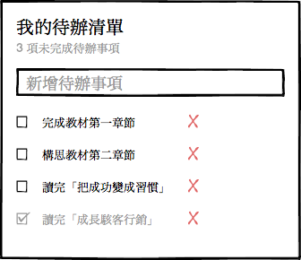
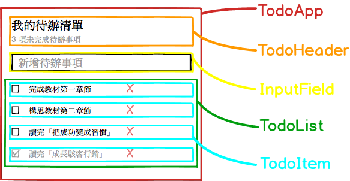

# Level 1. 用元件思維設計應用程式

歡迎來到「24 小時，React 快速入門」系列教學 :mortar_board: Level 1 ～！
> :bowtie:：Wish you have a happy learning!

## :checkered_flag: 關卡目標

1. 完成主線任務：
  1. 列出 TodoApp 的功能清單
  2. 使用「元件思維」設計 TodoApp
2. 習得心法：打通任督二脈，了解「**元件思維**」

## :triangular_flag_on_post: 主線任務

### 1. 列出 TodoApp 的功能清單

相信大家都有用過市面上的 TodoApp，一個簡易的 TodoApp 會有以下功能：

1. 列出所有待辦項目
2. 提示待辦數量
3. 新增待辦項目
4. 編輯待辦項目
5. 刪除待辦項目
6. 切換項目處理狀態

根據以上功能，我們畫出第一版 wireframe：

### 2. 使用元件思維，設計 TodoApp

> :neckbeard:：少年，我看你天資聰穎，是萬中選一的前端人，我這有一篇...[祕笈](https://medium.com/p/ab93203f6c53)，替你打通元件思維的任督二脈，你斟酌看看 :lollipop:

將上一步的 UI 劃分成多個元件，並且替它們取上名稱：

> :bowtie:：在這一階段我們必須盡可能得讓元件可以**重複利用**；思考邏輯是這樣的 - 因為 TodoList 中每一行待辦項目的 UI 都是相同的，僅顯示的資料不一樣，所以我們將待辦項目拉成一個 TodoItem 元件。

## :rocket:

｜ [主頁](../../../) ｜ [下一關. 建置簡易的開發環境](../level-02_initial-project) ｜

｜ :raising_hand: [我要提問](https://github.com/shiningjason1989/react-quick-tutorial/issues/new) ｜

