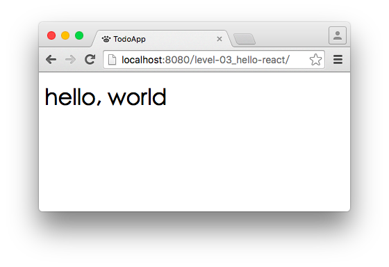

# Level 3. 使用 JSX 印出 hello, world

歡迎來到「24 小時，React 快速入門」系列教學 :mortar_board: Level 3 ～！
> :bowtie:：Wish you have a happy learning!


## :checkered_flag: 關卡目標

1. 完成主線任務：用 JSX 印出 hello, world
2. 獲得新技能：
  1. [React] 熟悉 JSX 語法
  2. [React] 了解 ReactDOM.render() 使用方法和時機


## :triangular_flag_on_post: 主線任務

### 1. 編輯 index.html

根據下方步驟，step by step 完成 index.html：

```html
<body>
  <!--
    1. 清空 div，並給它 ID：
       這區塊是要印出 hello, world 的地方，
       加入 ID 讓 React 可以抓到該元素
  -->
  <div id="app"></div>

  <!-- 略: react.js, react-dom.js, browser.js -->

  <!--
    2. 加入 script，並指定 `type=text/babel`：
       這區塊是我們編寫主要程式的地方。

       因為我們用的是 JSX 語法，而非瀏覽器認識的 ES5 語法，
       透過 Babel 可以將 JSX/ES6/ES7 轉譯成 ES5；
       所以需要指定 type，讓瀏覽器先將這段程式轉交給 Babel 處理
  -->
  <script type="text/babel">
    // 3. 使用 ReactDOM.render()：
    //    讓 `<h1>hello, world</h1>` 顯示在 `<div id="app">` 中
    ReactDOM.render(
      <h1>hello, world</h1>,
      document.getElementById('app')
    );
  </script>
</body>
```

### 2. 確認 hello, world 顯示在頁面上




## :book: 學習筆記

### 1. [React] JSX 語法

###### 1. 使用方式（詳見 [JSX in Depth](https://facebook.github.io/react/docs/jsx-in-depth.html)）

```js
// 1. JSX 讓你可以在 JS 中，使用類 HTML 語法
var app = (
  <div>
    <div>hello, world</div>
  </div>
);

// 2. JSX 讓你可以在類 HTML 中，取得 JS 變數值
var text = 'hello, world';
var app = <div>{text}</div>;

// 3. JSX 讓你可以在類 HTML 中，取得 JS 陣列值
var children = [
  <span>hello</span>,
  <span>, </span>,
  <span>world</span>
];
var app = <div>{children}</div>;

// 4. JSX 讓你可以在類 HTML 中，執行 JS function，並取得回傳值
var texts = ['hello', ', ', 'world'];
var app = (
  <div>
    {
      texts.map(function(text) {
        return <span>{text}</span>;
      }) // 注意：這裡不要加分號（;）
    }
  </div>
);

// 5. JSX 讓你可以在類 HTML 中，執行 if/else 和字串組合
var text = 'world';
var app = (
  <div>{ text === undefined ? 'hello' : 'hello, ' + text }</div>
);

// PS. 上面五種方法，app 在瀏覽器中會顯示一樣的畫面
```

### 2. [React] ReactDOM.render() API

###### 1. 使用方式（詳見 [API 文件](https://facebook.github.io/react/docs/top-level-api.html#reactdom.render)）

```js
// Good
ReactDOM.render(
  <div>hello, world</div>,       // React element
  document.getElementById('app') // DOM container node
);

// Bad: 請注意第一個參數（React element）不能給予兩個元素，必須用一個父元素包起來
ReactDOM.render(
  <h1>hello</h1>
  <span>, world</span>,
  document.getElementById('app')
)
```

###### 2. 說文解字

render 中文為「渲染」，有繪製的意思；因此這支 API 翻成白話文就是「***請幫我繪製 React element (`<div>hello, world</div>`) 在 DOM container node (`document.getElementById('app')`) 中***」


## :rocket:

｜ [主頁](../../../) ｜ [上一關](../level-02_initial-project) ｜ [下一關. 完成第一個 React 元件](../level-04_first-component) ｜

｜ :raising_hand: [我要提問](https://github.com/shiningjason1989/react-quick-tutorial/issues/new) ｜


