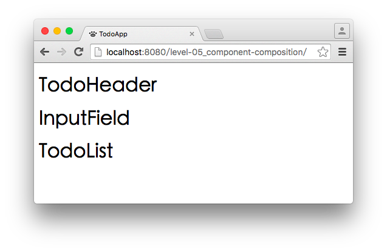

# Level 5. 組合多個 React 元件

歡迎來到「24 小時，React 快速入門」系列教學 :mortar_board: Level 5 ～！
> :bowtie:：Wish you have a happy learning!


## :checkered_flag: 關卡目標

1. 完成主線任務：完成所有元件雛形，並將它們組合起來
2. 習得心法：
  1. 了解元件組合的思維
  2. 清楚元件封裝的時機


## :triangular_flag_on_post: 主線任務

### 1. 先熱身

完成 TodoHeader, TodoList, InputField 三個元件，並讓它們顯示自己的名稱。

> :bowtie:：還記得上個關卡所學的技能嗎？還記得如何完成 TodoApp 這個元件嗎？你只需要依樣畫葫蘆即可！＾＾

### 2. 開始組合元件

為了要在頁面中渲染這些元件，我們在 TodoApp 中組合它們：

```js
/** TodoApp.js */

// 1. 使用元件類別前，記得先從 window.App 中取出
const {
  InputField,
  TodoHeader,
  TodoList
} = window.App;

class TodoApp extends React.Component {
  render() {
    // 2. 組合元件的觀念，與架構 HTML 元素是一樣的
    return (
      <div>
        <TodoHeader />
        <InputField />
        <TodoList />
      </div>
    );
  }
}

window.App.TodoApp = TodoApp;
```

最後，請確保你的瀏覽器會顯示：



### 3. 描繪元件細節

這一步，我們要完成 TodoHeader, TodoList, InputField 三個元件的細節，讓它們的排版與第一關設計的 wireframe 一樣：


### 4. 封裝重複行為，讓元件再利用

按照上述步驟，TodoList 的 render 方法程式會如下：

```js
/** TodoList.js */

render() {
  return (
    <ul>
      <li>
        <input type="checkbox" />
        <span>Item 1</span>
        <button>x</button>
      </li>
      <li>
        <input type="checkbox" />
        <span>Item 2</span>
        <button>x</button>
      </li>
      <li>
        <input type="checkbox" />
        <span>Item 3</span>
        <button>x</button>
      </li>
    </ul>
  );
}
```

> :bowtie:：你是否有跟我一樣的看法呢？每一筆待辦項目的 HTML 幾乎是一樣的，只是顯示的資料不同罷了！

***考量到項目會有重複的行為***，例如：切換處理狀態、編輯、刪除等，因此我們必須把每筆項目再封裝成單一元件。還記得第一關我們設計了哪些元件嗎？是的，上述步驟我們少了一個 TodoItem 元件！

因此這一步我們必須完成 TodoItem 元件，並且修改 TodoList 的程式如下：

```js
/** TodoList.js */

render() {
  return (
    <ul>
      <li>
        <TodoItem />
      </li>
      <li>
        <TodoItem />
      </li>
      <li>
        <TodoItem />
      </li>
    </ul>
  );
}
```

最後，請確認你的瀏覽器正常的顯示 TodoApp！

> :bowtie:：如果你有發現每筆項目似乎無法顯示不同的內容呢？！是的，這就是我們下一關必須解決的問題了！：）


## :book: 學習筆記

### [React] 心法

1. 元件是可以層層包覆的
2. 為了減少重複的程式碼、增加程式的重用性，我們可以透過元件封裝來解決


## :rocket:

｜ [主頁](../../../) ｜ [上一關](../level-04_first-component) ｜ [下一關. 使用 props 傳遞元件參數](../level-06_transferring-props) ｜

｜ :raising_hand: [我要提問](https://github.com/shiningjason1989/react-quick-tutorial/issues/new) ｜


