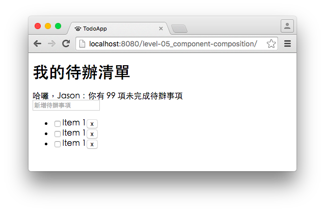

# Level 5. 組合多個 React 元件

歡迎來到「24 小時，React 快速入門」系列教學 :mortar_board: Level 5 ～！
> :bowtie:：Wish you have a happy learning!

## 階段目標

1. 熱身：使用上一階段學習的技能，建立 TodoHeader, InputField, TodoList 三個元件，並印出元件名稱
2. 完成主線任務：
    1. 在 TodoApp 元件中，組合三個元件
    2. 完成 TodoHeader, InputField, TodoList 的細節
    3. 將 TodoItem 抽出成可以重複使用的元件
3. 修煉內功心法：
    1. 了解元件設計的好處
    2. 了解元件是可以層層包覆的
    3. 了解該如何切割元件

## 主線任務

### 1. 確認 TodoApp 雛形顯示在頁面上

