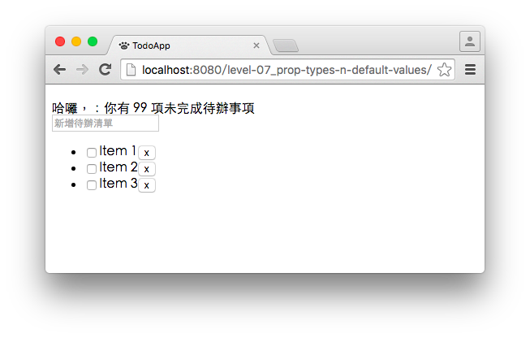
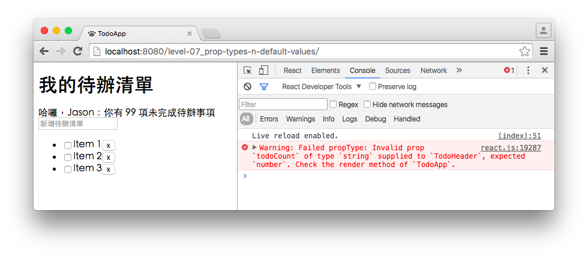

# Level 7. 培養好習慣，設計防呆的 React 元件

歡迎來到「24 小時，React 快速入門」系列教學 :mortar_board: Level 7 ～！
> :bowtie:：Wish you have a happy learning!


## :checkered_flag: 關卡目標

1. 完成主線任務：設計元件的防呆機制
2. 獲得新技能：
  1. [React] 驗證元件參數 (props) 的方法
  2. [React] 定義元件參數 (props) 的預設值
3. 習得心法：
  1. 體會設計防呆機制的好處
  2. 理解防呆機制的使用時機


## :triangular_flag_on_post: 主線任務

### 1. 先了解問題

在上個關卡中，你或許會看過以下畫面：



發現了嗎？待辦清單的**標題**和**使用者名稱**消失了！如果你細查程式碼：

```js
/** TodoApp.js */

render() {
  render() {
    return (
      <div>
        <TodoHeader todoCount={99} /> <!-- 你少給了 name 和 username 兩個參數 -->
        <InputField placeholder="新增待辦清單" />
        <TodoList />
      </div>
    );
  }
}
```

在現實世界中，這種小迷糊很常出現；因此讓客戶看到了不正確的 UI，而且你也會花很多時間、瀏覽很多支程式後才找到問題所在！

再讓我舉個例子：

```js
/** TodoHeader.js */

// 假使我們預期的是「顯示待辦數量加一」，例如：todoCount 等於 99 時，畫面顯示 100
render {
  return <div>{this.props.todoCount + 1}</div>;
}

/** TodoApp.js */

render {
  return (
    <div>
      <TodoHeader todoCount={99} />
      <TodoHeader todoCount="99" />
    </div>
  );
}

// 那麼，你知道最後畫面會顯示什麼嗎？
// 100
// 991
```

> :bowtie:：一不小心出錯，命運可是會大不同呀！所以在龐大的專案中，「***要如何讓自己設計的元件，正確的被其他開發者使用呢***」就是我們這一關要解決的！


### 2. 設計元件的防呆機制

React 提供兩種方式，讓你設計元件的防呆機制：

```js
/** TodoHeader.js */

class TodoHeader extends React.Component {
  // ...
}

// 1. 使用 propTypes 定義參數的型別
TodoHeader.propTypes = {
  title: React.PropTypes.string,
  username: React.PropTypes.string,
  todoCount: React.PropTypes.number
};

// 2. 使用 defaultProps 定義參數的預設值
TodoHeader.defaultProps = {
  title: '我的待辦清單',
  username: 'Guest',
  todoCount: 0
};
```

這一步，我們要依樣畫葫蘆完成 **TodoHeader** 和 **TodoItem** 的防呆機制！

### 3. 查看驗證失敗的警示訊息

當你替 TodoHeader 加上防呆機制後，如果你將字串遞給 todoCount 的話：

```js
<TodoHeader todoCount="99" />
```

打開瀏覽器的開發者工具，你會看到如下的警告：



> :bowtie:：加入元件參數的驗證機制，並不會讓整個應用程式停止運作，不過***它會讓開發者得知自己是否遺漏了什麼***；而一位前端工程師通常會隨時地查看開發者工具，因此達到防呆的效果。


## :book: 學習筆記

### 1. [React] 驗證元件參數 (props) 的方法

###### 1. 使用方法

```js
// 1. 在 ES6 中，propTypes 的宣告方式
class TodoApp extends React.Component {
  // ...
}

TodoApp.propTypes = {
  appName: React.PropTypes.string.isRequired // 更多 Validation 和客製化方法，請見官方文件
};

// 2. 在 ES7 中，你可以在類別中使用 static 宣告 propTypes
class TodoApp extends React.Component {
  static propTypes = {
    appName: React.PropTypes.string.isRequired
  };

  // ...
}

// 3. 使用 React.createClass 建立元件時，propTypes 的宣告方式
const TodoApp = React.createClass({
  propTypes: {
    appName: 'TodoApp'
  },

  // ...
});
```

###### 2. 參考連結

1. [Prop Validation | React](https://facebook.github.io/react/docs/reusable-components.html#prop-validation)

### 2. [React] 定義元件參數 (props) 的預設值

###### 1. 使用方法

```js
// 1. 在 ES6 中，defaultProps 的宣告方式
class TodoApp extends React.Component {
  // ...
}

TodoApp.defaultProps = {
  appName: 'Todo App'
};

// 2. 在 ES7 中，你可以在類別中使用 static 宣告 defaultProps
class TodoApp extends React.Component {
  static defaultProps = {
    appName: 'Todo App'
  };

  // ...
}

// 3. 使用 React.createClass 建立元件時，defaultProps 的宣告方式
const TodoApp = React.createClass({
  getDefaultProps() {
    return {
      appName: 'TodoApp'
    };
  },

  // ...
});
```

###### 2. 參考連結

1. [Default Prop Values | React](https://facebook.github.io/react/docs/reusable-components.html#default-prop-values)


### 3. [React] 心法

1. 設計元件的防呆機制，可以減少錯誤機率，提高元件重用性
2. 設計元件的防呆機制，可以讓開發者更輕易得知元件參數有哪些


## :rocket:

｜ [主頁](../../../) ｜ [上一關](../level-06_transferring-props) ｜ [下一關. 動態產生多個 React 元件](../level-08_dynamic-children) ｜

｜ :raising_hand: [我要提問](https://github.com/shiningjason1989/react-quick-tutorial/issues/new) ｜


