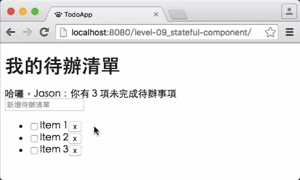

# Level 9. 管理 React 元件的內部狀態

歡迎來到「24 小時，React 快速入門」系列教學 :mortar_board: Level 9 ～！
> :bowtie:：Wish you have a happy learning!


## :checkered_flag: 關卡目標

1. 完成主線任務：讓待辦項目可以切換編輯模式，並完成刪除功能
2. 獲得新技能：
  1. [React] 初始 state 的方法
  2. [React] 取得 state 的方法
  3. [React] 更新 state 的方法
3. 習得心法：
  1. 了解 state 和 props 的差別
  2. 清楚什麼時機該用 state，什麼時候不該用


## :triangular_flag_on_post: 主線任務

### 1. 設計雛形



待辦項目提供兩種模式：編輯模式、瀏覽模式。

透過下面方式切換：

1. 雙點擊待辦項目，可切換為「編輯模式」
2. 按下 ESC 或點擊頁面其他地方，可切換為「瀏覽模式」

### 2. 修改 TodoItem

```js
class TodoItem extends React.Component {
  constructor(props, context) {
    super(props, context);

    // 1. 使用 class constructor (類別建構子) 初始元件狀態
    this.state = { editable: false };

    // 7. 在 ES6 component class 中，你必須手動綁定 this
    this.toggleEditMode = this.toggleEditMode.bind(this);
  }

  toggleEditMode() {
    // 6. 更新元件狀態來切換模式
    this.setState({ editable: !this.state.editable });
  }

  render() {
    // 2. 判斷目前模式為何，渲染不同的畫面
    return this.state.editable ? this.renderEditMode() : this.renderViewMode();
  }

  renderViewMode() {
    // 3. 將原本渲染「瀏覽模式」的程式，移至這裡
    // ...
  }

  renderEditMode() {
    // 4. 「編輯模式」使用 InputField 元件
    return (
      <InputField
        autoFocus                    // 5. autoFocus 讓使用者切換到編輯模式後，可以立即編打
        placeholder="編輯待辦事項"
        value={this.props.title}
        onBlur={this.toggleEditMode} // 8. 當使用者點擊其他地方，則切換為「瀏覽模式」
        onKeyDown={(e) => {          // 9. 當使用者按下 ESC，則切換為「瀏覽模式」
          if (e.keyCode === 27) {
            e.preventDefault();
            this.toggleEditMode();
          }
        }}
      />
    );
  }
}
```

### 3. 完成刪除待辦項目功能

```js
/* TodoItem.js */
// 1. 當刪除按鈕被點選，觸發上層元件 (TodoList) 傳遞的 onDelete callback
renderViewMode() {
  const { onDelete } = this.props;
  return (
    <div>
      <!-- ... -->
      <button onClick={() => onDelete && onDelete()}>x</button>
    </div>
  );
}

// 2. 完成 onDelete 的 propTypes or defaultProps

/* TodoList.js */
// 3. 當待辦項目被刪除，觸發上層元件 (TodoApp) 傳遞的 onDeleteTodo callback：
//    callback 必須傳遞 todo 的 id，讓上層元件知道哪一筆項目需要刪除；
//    使用 props 傳遞 callback 的好處是，可以不用在底層 view 元件中加入業務邏輯。
//
//    小筆記：讓 view 元件職責簡單，只需顯示 props 的資料，和呼叫 props 中相對應的 callback
render() {
  const { onDeleteTodo } = this.props;
  const todoElements = todos.map((todo) => (
    <li key={todo.id}>
      <TodoItem ... onDelete={() => onDeleteTodo && onDeleteTodo(todo.id)} />
    </li>
  ));
  return <ul>{todoElements}</ul>;
}

/* TodoApp.js */
class TodoApp extends React.Component {
  constructor(props, context) {
    super(props, context);
    // 4. 將 todos 搬到 state 中：
    //    放在 state 的好處是當使用 this.setState() 更新 todos 後，
    //    React 會幫你重新 render，讓使用者看到最新的畫面。
    //
    //    PS. React 的資料模型分兩種：props、state，
    //    你應該盡可能讓底層元件存取資料的方式是使用 props，
    //    所以我們將 todos 儲存在上層元件 (TodoApp) 的 state 中。
    this.state = {
      todos: [...]
    };
  }

  render() {
    // 5. 從 state 中取得 todos
    const { todos } = this.state;
    return (
      <div>
        <TodoHeader todoCount={todos.filter((todo) => !todo.completed).length} />
        <TodoList
          todos={todos}
          // 6. 呼叫 _deleteTodo，更新 todos 狀態
          onDeleteTodo={
            (id) => this.setState({
              todos: _deleteTodo(todos, id)
            })
          }
        />
      </div>
    );
  }
}

// 7. 將刪除邏輯抽成一個 function
const _deleteTodo = (todos, id) => {
  const idx = todos.findIndex((todo) => todo.id === id);
  if (idx !== -1) todos.splice(idx, 1);
  return todos;
};
```


## :book: 學習筆記

### 1. [React] 初始 state 的方法

###### 1. 使用方法

```js
// 使用 ES6 classes 宣告元件時
class TodoApp extends React.Component {
  constructor(props, context) {
    super(props, context);
    this.state = {
      firstName: 'Jason',
      lastName: 'Chung',
      email: prop.username + '@gmail.com'
    };
  }
}

// 使用 React.createClass 宣告元件時
const TodoApp = React.createClass({
  getInitialState() {
    return {
      firstName: 'Jason',
      lastName: 'Chung',
      email: this.prop.username + '@gmail.com'
    };
  }
});
```

###### 2. 參考連結

1. [Props in getInitialState Is an Anti-Pattern | React](https://facebook.github.io/react/tips/props-in-getInitialState-as-anti-pattern.html)

### 2. [React] 取得 state 的方法

###### 1. 使用方法

```js
// 不論用什麼方式宣告元件，state 的取得方法跟 props 一樣
render() {
  const { firstName, lastName } = this.state;
  // ...
}
```

### 3. [React] 更新 state 的方法

###### 1. 使用方法

```js
class TodoApp extends React.Component {
  constructor(props, context) {
    super(props, context);
    this.state = {
      firstName: 'Jason',
      lastName: 'Chung'
    };
  }

  handleClick() {
    // 1. 你可以只更新部分狀態
    this.setState({ firstName: 'Andy' });
    this.setState({ lastName: 'Lin' });

    this.setState({
      firstName: 'David',
      lastName: 'Cheng'
    });

    // 2. 呼叫 this.setState()，並不會立馬更新 this.state 的值：
    //    React 會等待元件跑到 render 這一個週期才會更新
    console.log(this.state); // { firstName: 'Jason', lastName: 'Chung' };

    // 3. 錯誤的更新方式！！！
    this.state.firstName = 'Andy';
  }
}
```

### 4. [React] 心法

1. React 有兩種資料模型：props 和 state；props 是由上層元件傳遞給下層，state 是由元件內部進行管理
2. 你應該盡量設計 stateless 的元件，讓元件只需負責顯示上層元件傳遞的 props
3. 如果元件內部有一些交互作用，你可以考慮將交互狀態存在 state 中

###### 參考連結

1. [Interactivity and Dynamic UIs](http://facebook.github.io/react/docs/interactivity-and-dynamic-uis.html)


## :rocket:

｜ [主頁](../../../) ｜ [上一關](../level-08_dynamic-children) ｜ [下一關. 使用 React 表單元件](../level-10_forms) ｜

｜ :raising_hand: [我要提問](https://github.com/shiningjason1989/react-quick-tutorial/issues/new) ｜


