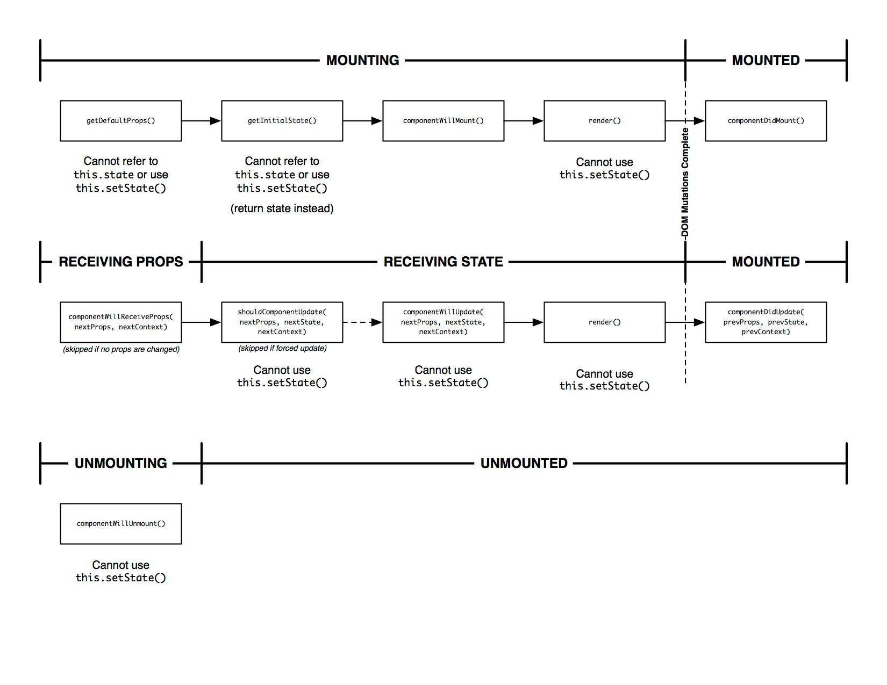

# Level 11. 瞭解 React 元件的生命週期

歡迎來到「24 小時，React 快速入門」系列教學 :mortar_board: Level 11 ～！
> :bowtie:：Wish you have a happy learning!


## :checkered_flag: 關卡目標

1. 完成主線任務：使用 AJAX 向後端取得待辦資料
2. 獲得新技能：
  1. [React] 使用 component lifecycle methods
  2. [ES6] 使用 promise 處理延遲(deferred)和非同步(asynchronous)
  3. [Web API] 使用 fetch API 處理 AJAX
3. 習得心法：
  1. 理解元件的生命週期，及 component lifecycle methods 被調用的順序
  2. 了解 component lifecycle methods 使用時機


## :triangular_flag_on_post: 主線任務

### 1. 理解 API 的使用方法

通常我們與後端介接資料會使用 REST API，後端的同事可能會提供如下的 API 文件：

```
URL: https://<baseApiUrl>/todos
HTTP Verb: GET
JSON Response Format:
  [
    {
      "id": 1,
      "title": "Item 1",
      "completed": false
    }
  ]
```

上方文件中，讓我們得知只要向 URL 發出 GET 請求，即可得到 JSON 格式的待辦陣列。偶爾，後端夥伴並沒那麼快將程式開發完成，這僅僅是一個規格而已，這時你可以做個假的 JSON 檔案，就像我們在這個範例要做的：

1. ***新增一個 todos.json 檔案***
2. ***在 todos.json 加入一些假的待辦資料***

還有另外一種方式可以讓你得到假的 API，譬如：[JSONPlaceholder](http://jsonplaceholder.typicode.com/) 等其他第三方資源有提供。

### 2. 調用 API 的時機

如果我們要在 TodoApp 元件開始渲染後，立馬去抓取待辦資料：

```js
class TodoApp extends React.Component {
  constructor(props, context) {
    super(props, context);
    this.state = {
      todos: [] // 1. 將原本的 todos 狀態清空
    };
  }

  // 2. 實作 componentDidMount 方法：
  //    該方法在元件第一次 render 後，會被呼叫；
  //    更多細節請見[學習筆記 1]
  componentDidMount() {
    // 3. 使用 ajax 請求 API：
    //    並將取回的待辦資料更新元件 state（見下一步）
  }
}
```

### 3. 使用 github/fetch 向後端 API 請求資料

###### 第一步. 引入 github/fetch 程式庫

從 [cdnjs](https://cdnjs.com/libraries/fetch) 中，複製 github/fetch 最新版本的連結，並貼到 index.html 中。

```html
<script src="https://cdnjs.cloudflare.com/ajax/libs/fetch/1.0.0/fetch.js"></script>
```

> :bowtie:：***如果你心裡正想為什麼要使用 github/fetch 的話？***其實你可以使用很多方法調用 API，如 jQuery.ajax() 等。不過考量到我們只是為了處理簡單的 ajax 請求，將整包 jQuery 拉進來，成本似乎太高了。因此***我建議大家使用 github/fetch 這個程式庫，它實作了 Web 最新的 Fetch API***，簡單又漂亮！：）

###### 第二步. 調用 API

如果要使用 fetch 調用 todos API，用法大致如下：

```js
/** TodoApp.js */

componentDidMount() {
  fetch('./todos.json')                         // 1. 使用 fetch 回傳的是 promise 物件
    .then((response) => response.json())        // 2. 解析 response 資料，將它轉成 js 物件
    .then((todos) => this.setState({ todos })); // 3. 更新元件 state
}
```

###### 參考連結

1. [github/fetch | Github](https://github.com/github/fetch)
2. [axios | Github](https://github.com/mzabriskie/axios)：AJAX 的其他解決方案
3. [jQuery.ajax() | jQuery](http://api.jquery.com/jquery.ajax/)


## :book: 學習筆記

### 1. [React] 使用 component lifecycle methods

React 提供七個 component lifecycle methods：

1. componentWillMount
2. componentDidMount
3. componentWillReceiveProps
4. shouldComponentUpdate
5. componentWillUpdate
6. componentDidUpdate
7. componentWillUnmount

讓你可以在元件生命週期中做一些事情。

> :bowtie:：***什麼是生命週期？***你可以想像就是元件的生老病死 :baby: :girl: :woman: :older_woman: :angel:。

一個元件從被建立到消滅，共會經歷以下三種狀態：

1. :baby: Mounting: 當元件實例(instance)被建立，並且根據 props 作第一次的渲染時
2. :woman: Updating: 當元件 props 或 state 被更新，並重新渲染時
3. :angel: Unmounting: 當元件實例被消滅時

而在每一種狀態切換時，React 會執行上方七種方法，讓你在切換點做點事情。

###### 1. 使用方法

```js
// 1. 你只需要在 class 中，實作生命週期方法：
class App extends React.Component {
  componentWillMount() {...}
  componentDidMount() {...}
  render() {...}
}

// 2. 如果你用 React.createClass()，使用方式也是一樣的
const App = React.createClass({
  componentWillMount() {...},
  componentDidMount() {...},
  render() {...}
});
```

###### 2. 生命週期圖



上方圖中：

1. 調用順序：第一排 Mounting -> 第二排 Updating * N 次（每當元件 props 和 state 更新，就會跑一次第二排）-> 第三排 Unmounting
2. 需要注意：
  1. 第一次 render 和第 N 次 render 前後呼叫的方法是不一樣的
  2. 有一些方法無法使用 this.setState()

###### 3. 應用方式

```js
class App extends React.Component {
  // Mounting:
  componentWillMount() {
    // 1. 這是第一次 render 前，更新 state 的最後機會：
    this.setState({ ageText: this.props.age + '歲' });
  }

  // Mounting:
  componentDidMount() {
    // 1. 如果你要操作實際的 DOM 元素：
    $('#app').hide();

    // 2. 如果你要請求 AJAX，或是設置 timer：
    $.ajax({ ... });
  }

  // Updating:
  componentWillReceiveProps(nextProps) {
    // 1. 如果你要根據新的 props 做一些運算：
    this.setState({ ageText: nextProps.age + '歲' });
  }

  // Updating:
  shouldComponentUpdate(nextProps, nextState) {
    // 1. 如果你想調校元件效能，不想要做沒有意義的 re-render，
    //    如下方只有在 id 不相同的情況下再 render 的話：
    return nextProps.id !== this.props.id;
  }

  // Updating:
  componentWillUpdate(nextProps, nextState) {
    // 1. 這是第 N 次 render 前，最後被調用的方法，
    //    通常可以拿來做 log
  }

  // Updating:
  componentDidUpdate(prevProps, prevState) {
    // 1. 如果你要操作更新後實際的 DOM 元素：
    $('#app').hide();
  }

  // Unmounting:
  componentWillUnmount() {
    // 1. 如果該元件消滅，也需要移除不必要的 AJAX 請求的話：
    xhr.abort();

    // 2. 如果你要移除不必要的傾聽事件：
    store.removeChangeListener(...);
  }
}
```

###### 4. 參考連結

1. [Lifecycle Methods | React](https://facebook.github.io/react/docs/component-specs.html#lifecycle-methods)

### 2. [ES6] 使用 promise 處理延遲(deferred)和非同步(asynchronous)

###### 1. 使用方法

```js
const promise = new Promise((resolve, reject) => {
  // resolve 用來傳遞非同步的成功結果，例如：AJAX 最後取得的資料或一秒後定義的值
  // reject 用來傳遞非同步的錯誤結果
  setTimeout(() => resolve('async'), 1000);
});

promise
  .then((res) => console.log(res))   // 透過 promise.then 可以先定義非同步成功後，要執行什麼
  .catch((err) => console.log(err)); // 透過 promise.catch 可以先定義非同步錯誤後，要執行什麼
```

###### 2. 參考連結

1. [Promise | MDN](https://developer.mozilla.org/zh-CN/docs/Web/JavaScript/Reference/Global_Objects/Promise)

### 3. [Web API] 使用 fetch API 處理 AJAX

###### 1. 使用方法

```js
const url = '/login';
const options = {
  method: 'POST',
  headers: {}
};

fetch(url, options)           // 使用 fetch 調用 AJAX 回傳 promise 物件
  .then((res) => res.json());
```

###### 2. 參考連結

1. [github/fetch | Github](https://github.com/github/fetch)
2. [Fetch | whatwg](https://fetch.spec.whatwg.org/)
3. [Fetch API | MDN](https://developer.mozilla.org/zh-CN/docs/Web/API/Fetch_API)


## :rocket:

｜ [主頁](../../../) ｜ [上一關](../level-10_forms) ｜ [下一關. 深入淺出 Flux](../level-12_flux) ｜

｜ :raising_hand: [我要提問](https://github.com/shiningjason1989/react-quick-tutorial/issues/new) ｜


